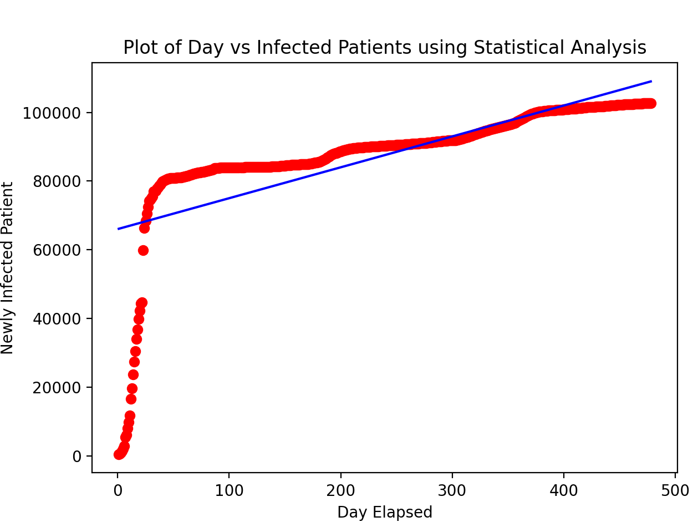
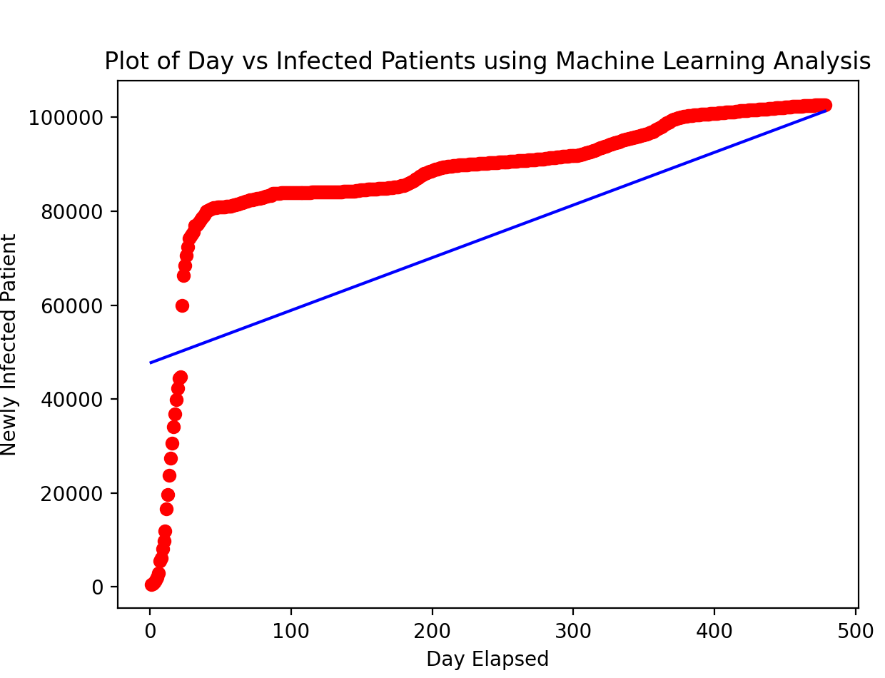

# Code in Place Spring 2021 - Stanford University

Extra suplemental materials dedicated to Code in Place Spring 2021 with Stanford University

Topics to be covered:
## 1. Functions (April 23, 2021) ##
  - Visit folder 2021\_04\_23_Functions (main.py file)
  - Be able to declare, implement, and call functions
  - ```python
    def single_function(input_1, input_2, input_3):
      output = input_1 * input_2 * input_3
      return output
    
    def multi_function(input_1, input_2):
      # Begin by declaring def, brackets, and colon sign (:)
      output_1 = input_1 + input_2
      output_2 = input_1 * input_2
      
      # The correct word is return, NOT result
      return output_1, output_2
    
    def main():
      x, y = sample_function(3, 7)
      
    if __name__ == "__main__":
      main()
    ```

## 2. Iterations, Conditionals, Increments or Decrements (April 25, 2021) ##
  - For-Loop
    ```python
    for i in range(0,10,2):
      print(i)
    ```
  - While-Loop
    ```python
    i = 0
    while i < 
      print(i)
      i = i+1
    ```
  - If-Else
    ```python
    if i < 0:
      print(f"The number {i} is a negative number")
    else:
      print(f"The number {i} is a positive number")
    ```
  - If-Elif
    ```python
    if i < 0:
      print(f"The number {i} is a negative number")
    elif i == 0:
      print(f"The number {i} is exactly zero")
    else:
      print(f"The number {i} is a positive number")
    ```
  - Increment or decrement
    ```python
    i = 1
    # Method 1 (Intuitive Mode)
    i = i + 1
    # Method 2 (Compact Mode)
    i += 1
    # Method 3 (PRO Mode)
    i -= -1
    ```

## 3. Accessing Main Functions (April 30, 2021) ##
  - Reference: https://youtu.be/sugvnHA7ElY 
  - ```python
    def main():
      pass
    ```
  - ```python
    if __name__ == "__main__":
      pass
    ```
  - Using none of the above

## 4. Handling Library Dependencies (April 30, 2021) ##
  - ```python
    import math, os, sys # concatenate all libraries
    from math import random # only import a specific function
    ```
  - Using Python built-in libraries
  - Using different Python files
  - Using external third-party dependencies

## 5. Problem Solving with Python (May 07, 2021) ##
  - Running total (using endless while-loop or using sentient-value while-loop)
  - Calculating factorial (using for-loop or using recursion call)
  - Solving fizz-buzz problem
  - Non-decreasing input numbers
  - Playing palindrome
  - Debugging and identifying common errors, such as forgetting dependencies, incorrect syntaxes, or logic errors

## 6. Image Processing with Python Libraries (May 14, 2021) ##
  <table>
  <tr>
  <th> Original </th> <th> Bordered </th>
  </tr>
  <td>  </td>
  <td> <b> Coming Soon </b> </td>  
  
  <tr>
  <th> Rotated </th> <th> Mirrored </th>
  </tr>
  
  <tr>
  <td>  </td>
  <td>  </td>
  </tr>

  <tr>
  <th> Cropped </th> <th> Shrunk </th>
  </tr>
  
  <tr>
  <td>  </td>
  <td>  </td>
  </tr> 
  </table>

## 7. Data Science with Python Libraries (May 21, 2021) ##
  <table>
  <tr>
  <th> Statistical Analysis </th> <th> Machine Learning Analysis </th>
  </tr>
  <tr>
  <td>  </td>
  <td>  </td>
  </tr>
  <tr>
  <td> </td>
  <td> </td>
  </tr>
  </table>
  
 The final session of Code in Place will cover the following topics 
 - How to handle files and retrieve data inside 
 - How to process the retrieved raw data into meaningful pieces of information
 - How to display those pieces of information to discernable patterns
 - One more thing: how to perform mathematical analysis to deduce trend from the existing data
  
## 8. Real World Application of using Python Containers (May 22, 2021) ##
Python provides several useful containers that can store, retrieve, and even modify any data inside. The example below demonstrates on how Python decipher image data from digital imaging and communication (DICOM) data format to slices of images
